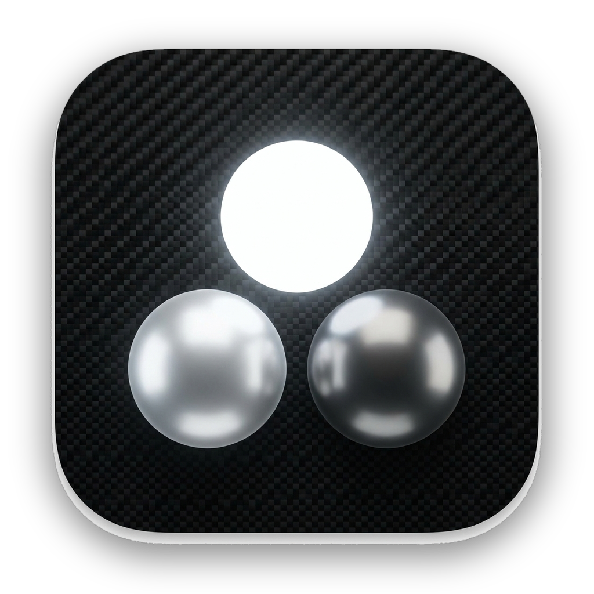

<p align="center">
  
</p>

<h1 align="center">Council</h1>

<p align="center">
  <b>One question. A roundtable of AI minds. You decide.</b><br>
  A native macOS app that puts the same question to several LLMs, lets them
  critique each other blind, and shows you where they agree — and where they don't.
</p>

<p align="center">
  
  
  
  
</p>

---

## The idea

Asking one model a hard question gives you one model's blind spots. Council convenes
a panel instead. The same prompt goes to several advisors at once — Claude, GPT,
Gemini and more — each answers independently, and then the interesting part begins.

## How it works

1. **Ask.** Pose a question to your council (three advisors by default; each can be any of nine providers).
2. **Parallel answers.** Every advisor responds at once, streaming live in its own panel.
3. **Blind peer review.** Each advisor critiques the others' answers without knowing who wrote them — no brand bias, just the argument.
4. **Divergence.** See exactly where the council splits, and why.
5. **Synthesis.** A distilled read of where the answers converge.
6. **You decide.** Council lays out the spread; the judgment stays yours.

## Features

- 🧠 **Up to nine providers** — Claude · GPT (OpenAI) · Gemini · DeepSeek · Grok (xAI) · Mistral · Perplexity · OpenRouter · Ollama (local — needs [Ollama](https://ollama.com) installed & running + a model pulled, e.g. `ollama pull llama3.2`)
- ⚡ **Live streaming** answers, side by side
- 🎭 **Distinct personas** per seat (Analyst · Practitioner · Skeptic) for real divergence — not three ways of saying the same thing
- 😈 **Devil's Advocate** role to pressure-test the consensus
- 🔭 **Divergence & Synthesis** as first-class views, alongside a full **Peer Review** page
- 🖼️ **Vision** — drop in an image for the models that support it
- 💸 **Calm cost estimate** — a running token/$ tally, your spend at a glance, and an optional spend alert
- 📤 **Export** to Markdown, PDF, or image; **share councils** as importable presets
- 💾 **Local history** of every session
- 🪟 **Native SwiftUI** — real Liquid Glass on macOS 26, a graceful material fallback on 14+

## Privacy — bring your own keys

Council is **100% local. No account, no server, no telemetry.**

- Your API keys live **only in the macOS Keychain.** They're masked in the UI and are **never** written to disk, exports, logs, or session files.
- Each key is sent **only** to that provider's own endpoint, over HTTPS (Ollama stays on `localhost`).
- You pay the providers directly with your own keys — Council never sits in the middle.

Don't have a key yet? Council links you straight to each provider's console from the key-entry step.

## Install

**Download** the macOS build from the [latest release](../../releases/latest), unzip it, and drag `Council.app` to Applications. Requires **macOS 14 or later**.

> ⚠️ **First launch:** Council isn't signed with a paid Apple certificate (it's a free, solo, open-source project), so macOS Gatekeeper warns once. To open it: **right-click `Council.app` → Open → Open**, or **System Settings → Privacy & Security → "Open Anyway"**. It opens normally after that.
>
> Rather build it yourself? The whole app is in this repo — see [Build from source](#build-from-source).

### Build from source

```sh
git clone https://github.com/albertofettucini/Council.git
cd Council
open Council.xcodeproj   # Xcode 16+ (Xcode 26 for the Liquid Glass build)
# ⌘R to run
```

No dependencies, no package manager — pure SwiftUI + Foundation.

## A typical question

> *"Should a two-person startup adopt microservices on day one?"*

Claude weighs the trade-offs, GPT pushes back on premature complexity, Gemini brings
the ops angle. The peer-review round catches where one of them overreached, Divergence
shows the real fault line, and Synthesis hands you a decision-ready summary.

## Roadmap

- Apple on-device model as a no-key seat
- Selective deliberation — review only the seats you choose
- Decision journal — capture what you decided, and why

## Contributing

Issues and PRs welcome. Council is one person's project — keep changes focused and the
privacy guarantees intact: no telemetry, and keys never leave the Keychain.

## Contact

Questions, ideas, or feedback? Open an issue — or reach me at **joseph.thecouncil@gmail.com**.

## License

[MIT](LICENSE) © 2026 Joseph

---

<p align="center"><sub>Made for people who'd rather weigh a few good opinions than trust one.</sub></p>
